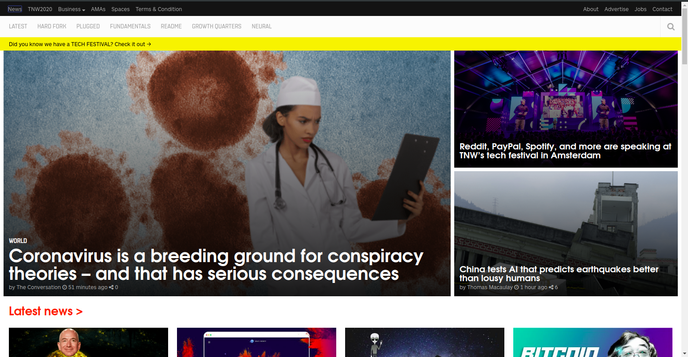

# Clone - "The Next Web" Website

> This is a clone of ["The Next Web" Website (TNW)](https://thenextweb.com/), created to practice responsive layouts with media queries using a mobile first approach.

## Features

- Responsive layout: support to different screen sizes
- Positioning using flex and grid
- Images applied in CSS backgrounds with position adjustments
- External fonts imports inside CSS
- Icons from fontawesome.com

## Built With

- HTML5
- CSS3: Media Queries, Grid, Flexbox, Background-image, Transform

## Live Demo

["The Next Web" Website Clone](https://ezeilo-su.github.io/the-next-web-clone/)

## Authors

👤 **Felipe Augusto Rosa**

- Github: [@flpfar](https://github.com/flpfar)
- Twitter: [@flpfar](https://twitter.com/flpfar)
- Linkedin: [Felipe Augusto Rosa](https://www.linkedin.com/in/felipe-augusto-rosa-7b96a4b1)

👤 **Sunday Uche Ezeilo**

- Github: [@sundayezeilo](https://github.com/ezeilo-su)
- Twitter: [@SundayEzeilo](https://twitter.com/SundayEzeilo)
- Linkedin: [Sunday Ezeilo](https://www.linkedin.com/in/sunday-ezeilo-a6a67664/)

## 🤝 Contributing

Contributions, issues and feature requests are welcome!

Feel free to check the [issues page](issues/).

## Show your support

Give a ⭐️ if you like this project!
